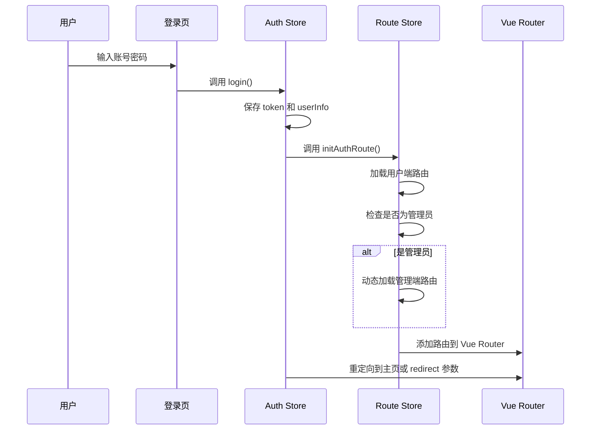

# 路由访问说明

## 路由结构概览

```mermaid
graph TD
    A[访问应用] --> B{是否登录?}
    B -->|否| C[/login 登录页]
    B -->|是| D[路由初始化]
    D --> E{用户角色?}
    E -->|普通用户| F[用户端路由]
    E -->|管理员| G[用户端路由 + 管理端路由]
    F --> H[/dashboard/workbench 主页]
    G --> H
    G --> I[/system-mgr 管理端]
```

## 一、路由分类

### 1. 基础路由（无需登录）

| 路径 | 说明 | 文件位置 |
|------|------|----------|
| `/` | 根路径，自动重定向 | `routes.inner.ts` |
| `/login` | 登录页面 | `routes.inner.ts` |
| `/public` | 公共访问示例 | `routes.inner.ts` |
| `/not-found` | 404 页面 | `routes.inner.ts` |

### 2. 用户端路由（需登录）

用户端路由定义在 `routes.static.ts` 中，主要包括：

| 路径 | 说明 | 组件 |
|------|------|------|
| `/dashboard` | 仪表盘目录 | - |
| `/dashboard/workbench` | 工作台（主页） | `views/dashboard/workbench/index.vue` |
| `/dashboard/monitor` | 监控页面 | `views/dashboard/monitor/index.vue` |
| `/setting/account` | 账户设置 | `views/setting/account/index.vue` |
| `/user-center` | 用户中心 | `views/build-in/user-center/index.vue` |

**主页配置**：
- 环境变量：`VITE_HOME_PATH=/dashboard/workbench`
- 登录后自动重定向到主页
- 访问 `/` 时，已登录用户会重定向到主页

### 3. 管理端路由（需管理员权限）

管理端路由定义在 `admin.routes.ts` 中，**动态加载**：

| 路径 | 说明 | 组件 |
|------|------|------|
| `/system-mgr` | 管理端根路径 | 重定向到 `/system-mgr/dashboard` |
| `/system-mgr/dashboard` | 管理端仪表盘 | `views/admin/dashboard/index.vue` |
| `/system-mgr/users` | 用户管理 | `views/admin/users/index.vue` |
| `/system-mgr/users/:id` | 用户详情 | `views/admin/users/detail.vue` |

**管理端路径配置**：
- 环境变量：`VITE_ADMIN_PATH=/system-mgr`
- 每次打包可以修改，增加安全性
- 只有管理员登录后才会加载这些路由

## 二、如何访问

### 访问主页（用户端）

1. **直接访问**：
   ```
   http://localhost:5173/#/dashboard/workbench
   ```

2. **登录后自动跳转**：
   - 访问 `/` 或 `/login`
   - 登录成功后自动跳转到主页（`VITE_HOME_PATH`）

3. **通过菜单导航**：
   - 登录后，左侧菜单会显示用户端路由
   - 点击"工作台"或"监控"等菜单项

### 访问管理端

1. **前提条件**：
   - 必须使用管理员账号登录（`role === 'admin'`）
   - 管理端路由会在登录后自动加载

2. **访问方式**：
   ```
   http://localhost:5173/#/system-mgr
   http://localhost:5173/#/system-mgr/dashboard
   http://localhost:5173/#/system-mgr/users
   ```

3. **权限验证**：
   - 如果非管理员尝试访问，会被重定向到登录页
   - 如果未登录，会被重定向到登录页

## 三、路由加载流程

### 用户登录流程



### 路由初始化逻辑

1. **用户端路由**（所有登录用户）：
   - 从 `routes.static.ts` 加载
   - 或从后端 API 动态获取（如果 `VITE_ROUTE_LOAD_MODE=dynamic`）

2. **管理端路由**（仅管理员）：
   - 检查用户角色是否为 `admin`
   - 如果是，动态导入 `admin.routes.ts`
   - 将管理端路由添加到 Vue Router

## 四、环境变量配置

### 前端环境变量（`frontend/.env`）

```env
# 主页路径（登录后重定向）
VITE_HOME_PATH=/dashboard/workbench

# 管理端路径前缀（必须与后端一致）
VITE_ADMIN_PATH=/system-mgr

# 路由模式（hash 或 history）
VITE_ROUTE_MODE=hash

# 基础路径
VITE_BASE_URL=/
```

### 后端环境变量（`.env`）

```env
# 管理端路径前缀（必须与前端一致）
ADMIN_PATH=/system-mgr
```

## 五、常见问题

### Q1: 登录后显示 404？

**原因**：
- 路由未正确初始化
- `VITE_HOME_PATH` 配置错误

**解决**：
1. 检查浏览器控制台是否有错误
2. 确认 `VITE_HOME_PATH` 配置的路由存在
3. 检查 `routes.static.ts` 中是否有对应的路由定义

### Q2: 无法访问管理端？

**原因**：
- 用户不是管理员
- 管理端路由未加载
- 路径配置不一致

**解决**：
1. 确认用户角色为 `admin`（检查 localStorage 中的 `role`）
2. 检查浏览器控制台，确认管理端路由是否加载
3. 确认前端和后端的 `ADMIN_PATH` 配置一致

### Q3: 管理端路径在哪里配置？

**答案**：
- 前端：`frontend/.env` 中的 `VITE_ADMIN_PATH`
- 后端：`.env` 中的 `ADMIN_PATH`
- 代码中：`frontend/src/router/admin.loader.ts` 第 10 行

### Q4: 如何修改主页？

**方法**：
1. 修改 `frontend/.env` 中的 `VITE_HOME_PATH`
2. 确保该路径在 `routes.static.ts` 中有定义
3. 重新启动开发服务器或重新打包

## 六、路由文件位置

| 文件 | 说明 |
|------|------|
| `frontend/src/router/routes.inner.ts` | 基础路由（登录页、404等） |
| `frontend/src/router/routes.static.ts` | 用户端静态路由定义 |
| `frontend/src/router/admin.routes.ts` | 管理端路由定义（动态加载） |
| `frontend/src/router/admin.loader.ts` | 管理端路由加载器 |
| `frontend/src/router/guard.ts` | 路由守卫（权限验证） |
| `frontend/src/store/router/index.ts` | 路由状态管理（初始化逻辑） |

## 七、开发建议

1. **添加新路由**：
   - 用户端路由：在 `routes.static.ts` 中添加
   - 管理端路由：在 `admin.routes.ts` 中添加

2. **修改路径**：
   - 修改环境变量后需要重启开发服务器
   - 生产环境需要重新打包

3. **权限控制**：
   - 在路由的 `meta` 中添加 `requiresAuth: true`
   - 管理端路由添加 `requiresAdmin: true`
   - 在路由守卫中验证权限

