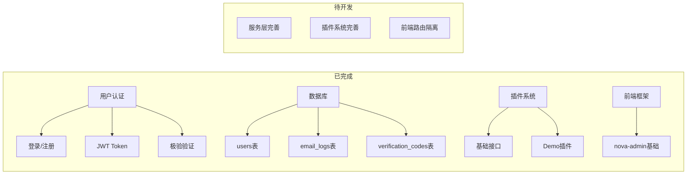
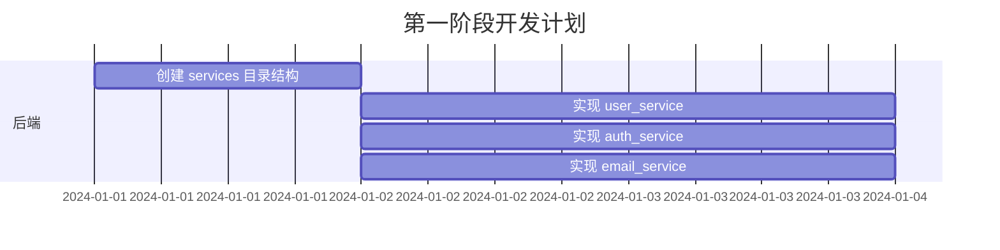

# FST 全栈开发计划 (Development Todo)

> 基于 `Go+Vue 高扩展性 MVC 插件系统架构方案.md` 分析当前项目状态，制定详细开发路线图。

---

## 当前项目状态总览



---

## 一、后端核心架构完善

### 1.1 服务层 (Services) - 缺失，需新建

**问题**: 当前控制器直接调用 Model，缺少 Service 层处理复杂业务逻辑。

**需要创建的文件**:
```
backend/app/services/
├── user_service.go          # 用户业务逻辑
├── auth_service.go          # 认证业务逻辑
└── email_service.go         # 邮件业务逻辑
```

**具体任务**:

| 序号 | 任务 | 文件 | 说明 |
|------|------|------|------|
| 1.1.1 | 创建 `user_service.go` | `backend/app/services/user_service.go` | 封装用户 CRUD、状态管理、分页查询等 |
| 1.1.2 | 创建 `auth_service.go` | `backend/app/services/auth_service.go` | 从 `auth_controller.go` 抽离登录注册验证逻辑 |
| 1.1.3 | 创建 `email_service.go` | `backend/app/services/email_service.go` | 从 `utils/email.go` 抽离，支持模板渲染 |

**代码示例** - `user_service.go`:
```go
package services

import (
    "fst/backend/app/models"
)

type UserService struct{}

func NewUserService() *UserService {
    return &UserService{}
}

// GetUserList 分页获取用户列表
func (s *UserService) GetUserList(page, page_size int, keyword string) ([]models.User, int64, error) {
    // 实现分页查询逻辑
}

// UpdateUserStatus 更新用户状态
func (s *UserService) UpdateUserStatus(user_id uint64, status uint8) error {
    // 实现状态更新逻辑
}
```

---

### 1.2 控制器分层 - 需重构

**问题**: 当前控制器未按 admin/user/public 分层。

**当前结构**:
```
backend/app/controllers/
├── auth_controller.go      # 混合了公共和用户接口
└── system_controller.go    # 混合了管理和公共接口
```

**目标结构**:
```
backend/app/controllers/
├── public/                 # 公共接口 (无需登录)
│   ├── auth_controller.go  # 登录、注册、忘记密码
│   └── captcha_controller.go
├── user/                   # 用户接口 (需登录)
│   ├── profile_controller.go
│   └── settings_controller.go
└── admin/                  # 管理接口 (需管理员权限)
    └── user_controller.go
```

**具体任务**:

| 序号 | 任务 | 操作 |
|------|------|------|
| 1.2.1 | 创建 `controllers/public/` 目录 | 新建 |
| 1.2.2 | 创建 `controllers/user/` 目录 | 新建 |
| 1.2.3 | 创建 `controllers/admin/` 目录 | 新建 |
| 1.2.4 | 拆分 `auth_controller.go` | 公共部分移至 `public/auth_controller.go` |
| 1.2.5 | 拆分 `system_controller.go` | 管理部分移至 `admin/` |
| 1.2.6 | 更新 `routes/routes.go` | 按新结构重新组织路由 |

---

### 1.4 插件系统完善

**当前状态**:
- `interface.go` 定义了基础接口 ✅
- `demo/plugin.go` 有示例插件 ✅
- 缺少生命周期管理、依赖管理、配置隔离

**需要扩展的功能**:

| 序号 | 任务 | 文件 | 说明 |
|------|------|------|------|
| 1.4.1 | 增加插件优先级 | `plugins/interface.go` | 添加 `Priority() int` 方法 |
| 1.4.2 | 增加插件依赖 | `plugins/interface.go` | 添加 `Dependencies() []string` 方法 |
| 1.4.3 | 增加插件配置 | `plugins/interface.go` | 添加 `Configure(config map[string]interface{})` |
| 1.4.4 | 增加插件卸载 | `plugins/interface.go` | 添加 `Shutdown() error` 方法 |
| 1.4.5 | 增加数据库迁移 | `plugins/interface.go` | 添加 `Migrate() error` 方法 |
| 1.4.6 | 插件注册器优化 | `plugins/manager.go` | 新建，实现排序、依赖解析 |

**扩展后的接口**:
```go
type Plugin interface {
    Name() string
    Version() string
    Priority() int                              // 新增：加载优先级
    Dependencies() []string                     // 新增：依赖的其他插件
    Configure(config map[string]interface{})    // 新增：接收配置
    Migrate() error                             // 新增：数据库迁移
    Init() error
    RegisterRoutes(router *gin.RouterGroup)
    Shutdown() error                            // 新增：关闭清理
}
```

---

### 1.5 中间件扩展

**当前已有**:
- `auth.go` - JWT 认证 ✅
- `cors.go` - 跨域 ✅

**需要新增**:

| 序号 | 文件 | 用途 |
|------|------|------|
| 1.5.1 | `middleware/logger.go` | 请求日志记录 |
| 1.5.2 | `middleware/ratelimit.go` | 接口限流 |

---

## 二、后端路由重构

### 2.1 路由分组优化

**当前问题** (见 `routes/routes.go`):
- 路由层级混乱，`/api/v1/user` 和 `/api` 混用
- 缺少版本化管理
- Admin 路由未独立

**目标结构**:
```go
api := router.Group("/api")
{
    // V1 版本
    v1 := api.Group("/v1")
    {
        // 公共接口 (无需登录)
        public := v1.Group("/public")
        {
            public.POST("/login", ...)
            public.POST("/register", ...)
            public.POST("/forgot-password", ...)
        }

        // 用户接口 (需登录)
        user := v1.Group("/user")
        user.Use(middleware.AuthMiddleware())
        {
            user.GET("/profile", ...)
            user.PUT("/profile", ...)
        }

        // 管理接口 (需管理员)
        admin := v1.Group("/admin")
        admin.Use(middleware.AuthMiddleware(), middleware.AdminOnly())
        {
            admin.GET("/users", ...)
        }
    }
}
```

---

## 三、前端架构完善

### 3.1 路由隔离 (Admin/User)

**当前状态**: 管理端和用户端路由混在一起。

**需要修改的文件**:

| 序号 | 文件 | 任务 |
|------|------|------|
| 3.1.1 | `frontend/src/router/index.ts` | 拆分管理端和用户端路由 |
| 3.1.2 | `frontend/.env` | 添加 `VITE_ADMIN_PATH` 配置 |
| 3.1.3 | `frontend/src/router/admin.ts` | 新建管理端路由模块 |
| 3.1.4 | `frontend/src/router/user.ts` | 新建用户端路由模块 |

### 3.2 API 服务层完善

**需要新增的 API 文件**:
```
frontend/src/service/api/
├── auth.ts          # 认证相关 (已有基础)
└── user.ts          # 用户管理
```

### 3.3 TypeScript 类型定义

**需要新增的类型文件**:
```
frontend/src/typings/entities/
└── user.d.ts        # 用户实体
```

---

## 四、开发优先级排序

### 第一阶段：核心底座 (优先级: P0)



| 序号 | 任务 | 涉及文件 | 预估改动 |
|------|------|----------|----------|
| P0-1 | 创建 services 目录 | `backend/app/services/` | 新建目录 |
| P0-2 | 创建 user_service.go | `services/user_service.go` | ~150行 |
| P0-3 | 创建 auth_service.go | `services/auth_service.go` | ~200行 |
| P0-4 | 创建 email_service.go | `services/email_service.go` | ~100行 |

### 第二阶段：控制器重构 (优先级: P1)

| 序号 | 任务 | 涉及文件 |
|------|------|----------|
| P1-1 | 创建 controllers/public/ | 新建目录 |
| P1-2 | 创建 controllers/user/ | 新建目录 |
| P1-3 | 创建 controllers/admin/ | 新建目录 |
| P1-4 | 拆分 auth_controller | 移动到 public/ |
| P1-5 | 创建 admin/user_controller | 用户管理 CRUD |
| P1-6 | 重构路由分组 | `routes/routes.go` |

### 第三阶段：插件系统完善 (优先级: P2)

| 序号 | 任务 | 涉及文件 |
|------|------|----------|
| P3-1 | 扩展 Plugin 接口 | `plugins/interface.go` |
| P3-2 | 创建 PluginManager | `plugins/manager.go` |
| P3-3 | 实现插件排序加载 | `plugins/manager.go` |
| P3-4 | 实现插件配置隔离 | `plugins/config.go` |

### 第四阶段：前端对接 (优先级: P3)

| 序号 | 任务 | 涉及文件 |
|------|------|----------|
| P3-1 | 新增用户管理页面 | `views/setting/account/` |
| P3-2 | 前端路由隔离 | `router/index.ts` |
| P3-3 | 完善 API 服务层 | `service/api/` |

---

## 五、具体函数/数据变更清单

### 5.1 需要修改的现有文件

---

#### `backend/app/plugins/interface.go`

**修改**: 扩展 Plugin 接口

**修改**: 扩展 Plugin 接口

```go
// 原接口 (第 8-20 行)
type Plugin interface {
    Name() string
    Version() string
    Init() error
    RegisterRoutes(router *gin.RouterGroup)
}

// 改为:
type Plugin interface {
    // 基础信息
    Name() string
    Version() string
    Description() string                        // 新增

    // 生命周期
    Priority() int                              // 新增: 加载优先级 (越小越先加载)
    Dependencies() []string                     // 新增: 依赖的插件名称列表
    Configure(config map[string]interface{})    // 新增: 接收配置
    Migrate() error                             // 新增: 数据库迁移
    Init() error
    RegisterRoutes(router *gin.RouterGroup)
    Shutdown() error                            // 新增: 优雅关闭
}
```

---

#### `backend/routes/routes.go`

**修改**: 重构路由分组结构（已基本完成，仅需微调）

---

### 5.2 需要新建的文件清单

| 文件路径 | 类型 | 核心函数/结构 |
|----------|------|---------------|
| `backend/app/services/user_service.go` | Service | `GetList()`, `GetByID()`, `Create()`, `Update()`, `Delete()`, `UpdateStatus()` ✅ |
| `backend/app/services/auth_service.go` | Service | `Login()`, `Register()`, `ValidateToken()`, `RefreshToken()` ✅ |
| `backend/app/services/email_service.go` | Service | `SendEmail()`, `SendTemplateEmail()` |
| `backend/app/controllers/admin/user_controller.go` | Controller | `List()`, `Detail()`, `Create()`, `Update()`, `Delete()` ✅ |
| `backend/internal/middleware/logger.go` | Middleware | `LoggerMiddleware()` |
| `backend/internal/middleware/ratelimit.go` | Middleware | `RateLimitMiddleware()` |
| `backend/app/plugins/manager.go` | Plugin | `LoadPlugins()`, `SortByPriority()`, `ResolveDependencies()` |

---

## 六、检查清单 (Checklist)

### 开发前检查
- [ ] 确认 MySQL 服务正常运行
- [ ] 确认 `.env` 配置正确
- [ ] 执行 `go mod tidy` 确保依赖完整
- [ ] 前端执行 `pnpm install` 确保依赖完整

### 后端开发检查
- [ ] 所有数据库字段使用 `snake_case` 命名
- [ ] Model 结构体 `db` 标签与数据库字段一致
- [ ] 新增表包含 `create_time`, `update_time`, `delete_time` 字段
- [ ] Service 层处理业务逻辑，Controller 只做参数校验和响应
- [ ] 所有接口返回格式 `{code, data, message}`

### 前端开发检查
- [ ] TypeScript 类型与后端返回字段匹配
- [ ] API 请求函数正确处理响应格式
- [ ] 路由权限配置正确

---

## 七、快速开始命令

```bash
# 1. 后端开发
cd backend
go run cmd/main.go

# 2. 前端开发
cd frontend
pnpm dev

# 3. 构建发布
./build.bat    # Windows
./build.ps1    # PowerShell
```

---

> **下一步行动**: 
> - Services 层已基本完成 ✅
> - 下一步：完善插件系统，实现插件生命周期管理和依赖解析
> - 或：实现中间件扩展（logger, ratelimit）
