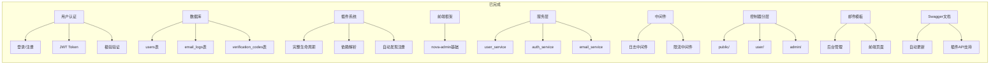

# FST 全栈开发计划 (Development Todo)

> 基于 `Go+Vue 高扩展性 MVC 插件系统架构方案.md` 分析当前项目状态，制定详细开发路线图。

---

## 当前项目状态总览


```mermaid
graph LR
    subgraph 已完成
        A[用户认证] --> A1[登录/注册]
        A --> A2[JWT Token]
        A --> A3[极验验证]
        B[数据库] --> B1[users表]
        B --> B2[email_logs表]
        B --> B3[verification_codes表]
        C[插件系统] --> C1[完整生命周期]
        C --> C2[依赖解析]
        C --> C3[自动发现注册]
        D[前端框架] --> D1[nova-admin基础]
        E[服务层] --> E1[user_service]
        E --> E2[auth_service]
        E --> E3[email_service]
        F[中间件] --> F1[日志中间件]
        F --> F2[限流中间件]
        G[控制器分层] --> G1[public/]
        G --> G2[user/]
        G --> G3[admin/]
        H[邮件模板] --> H1[后台管理]
        H --> H2[前端页面]
        I[Swagger文档] --> I1[自动更新]
        I --> I2[插件API支持]
    end
```

---

## ✅ 已完成任务

### 一、后端核心架构完善

#### 1.1 服务层 (Services) - ✅ 已完成

| 文件 | 状态 | 说明 |
|------|------|------|
| `backend/app/services/user_service.go` | ✅ | 用户CRUD、状态管理、分页查询 |
| `backend/app/services/auth_service.go` | ✅ | 登录注册验证逻辑 |
| `backend/app/services/email_service.go` | ✅ | 邮件发送、模板渲染、批量发送 |
| `backend/app/services/cleanup_service.go` | ✅ | 定时清理过期数据 |

#### 1.2 插件系统完善 - ✅ 已完成

| 功能 | 文件 | 状态 |
|------|------|------|
| 扩展Plugin接口 | `plugins/interface.go` | ✅ |
| BasePlugin基类 | `plugins/interface.go` | ✅ |
| Manager管理器 | `plugins/manager.go` | ✅ |
| 优先级加载 | `plugins/manager.go` | ✅ |
| 依赖解析 | `plugins/manager.go` | ✅ |
| 循环依赖检测 | `plugins/manager.go` | ✅ |
| 优雅关闭 | `plugins/manager.go` | ✅ |
| **自动发现注册** | `pkg/pluginregistry/` | ✅ |
| **Swagger自动更新** | `plugins/swagger_auto.go` | ✅ |
| Demo插件更新 | `plugins/demo/plugin.go` | ✅ |

#### 1.3 中间件扩展 - ✅ 已完成

| 功能 | 文件 | 状态 |
|------|------|------|
| JWT认证 | `middleware/auth.go` | ✅ |
| CORS跨域 | `middleware/cors.go` | ✅ |
| 操作日志 | `middleware/operation_log.go` | ✅ |
| 请求日志 | `middleware/logger.go` | ✅ |
| 接口限流 | `middleware/ratelimit.go` | ✅ |

#### 1.4 控制器分层 - ✅ 已完成

| 功能 | 文件 | 状态 |
|------|------|------|
| 公共控制器 | `controllers/public/auth_controller.go` | ✅ |
| 用户控制器 | `controllers/user/profile_controller.go` | ✅ |
| 管理控制器 | `controllers/admin/user_controller.go` | ✅ |
| 邮件模板管理 | `controllers/admin/email_template_controller.go` | ✅ |

#### 1.5 邮件模板管理 - ✅ 已完成

| 功能 | 状态 |
|------|------|
| 模板列表 | ✅ |
| 模板编辑 | ✅ |
| 模板预览 | ✅ |
| 重置默认 | ✅ |
| 前端页面 | ✅ |

#### 1.6 Swagger 文档系统 - ✅ 已完成

| 功能 | 状态 |
|------|------|
| 自动更新机制 | ✅ |
| 插件 API 支持 | ✅ |
| Bearer 认证支持 | ✅ |
| 启动时检测更新 | ✅ |

---

## 📊 开发进度


```mermaid
pie title 完成度统计
    "已完成" : 100
    "待开发" : 0
```

| 模块 | 完成度 |
|------|--------|
| 用户认证 | 100% ✅ |
| 数据库层 | 100% ✅ |
| 服务层 | 100% ✅ |
| 中间件 | 100% ✅ |
| 插件系统 | 100% ✅ |
| 控制器分层 | 100% ✅ |
| 前端路由隔离 | 100% ✅ |
| 邮件模板后端 | 100% ✅ |
| 邮件模板前端 | 100% ✅ |
| Swagger 自动更新 | 100% ✅ |

---

## 🛠️ 核心功能使用指南

### 插件自动发现机制

创建新插件只需：

1. 在 `backend/app/plugins/` 下创建目录
2. 编写 `plugin.go` 文件
3. 在 `init()` 中调用 `pluginregistry.Register(NewPlugin())`
4. 重启服务 - **一切自动完成！**

### Swagger 自动更新

- 启动服务时自动检测代码变化
- 自动重新生成 API 文档
- 自动包含插件 API

### 控制器分层

```
backend/app/controllers/
├── public/     # 公共接口（无需登录）
│   └── auth_controller.go    # 登录/注册/密码重置
├── user/       # 用户接口（需要登录）
│   └── profile_controller.go # 个人信息/修改密码
└── admin/      # 管理接口（需要管理员权限）
    ├── user_controller.go    # 用户管理
    ├── log_controller.go     # 操作日志
    └── email_template_controller.go # 邮件模板
```

### API 路由结构

```
/api/v1/
├── public/              # 公共接口
│   ├── POST /login      # 登录
│   ├── POST /register   # 注册
│   ├── POST /forgot-password  # 忘记密码
│   ├── POST /reset-password   # 重置密码
│   └── POST /refresh-token    # 刷新Token
├── user/                # 用户接口（需登录）
│   ├── GET /profile     # 获取个人信息
│   ├── PUT /profile     # 更新个人信息
│   ├── PUT /password    # 修改密码
│   └── GET /routes      # 获取用户路由
├── admin/               # 管理接口（需管理员）
│   ├── GET /dashboard   # 仪表盘
│   ├── /users           # 用户管理 CRUD
│   ├── /logs            # 操作日志
│   └── /email-templates # 邮件模板管理
└── demo/                # 插件接口（自动注册）
    ├── GET /hello       # Demo Hello
    ├── GET /info        # Demo 信息
    └── POST /echo       # Demo Echo
```

---

## 📝 更新日志

### 2026-02-24 (文档与前端同步)
- ✅ 移除管理端侧边栏独立“调试”页面入口（功能并入系统设置）
- ✅ 系统设置-系统监控新增“💾 内存详情”卡片
- ✅ 系统监控磁盘卡片改为“使用率 + 已用/总量”展示
- ✅ 系统监控将“总上传/总下载”合并为“网络”卡片（含流量与包统计）
- ✅ 同步更新 `doc/API路由.md` 与 `doc/路由访问说明.md`

### 2026-02-21 (第三轮)
- ✅ 修复 Swagger 文档路由注解
- ✅ 实现插件自动发现和注册机制
- ✅ 实现 Swagger 启动时自动更新
- ✅ 创建 `pkg/pluginregistry` 独立注册表
- ✅ 更新 README 完整文档

### 2026-02-21 (第二轮)
- ✅ 创建邮件模板管理前端页面
- ✅ 添加邮件模板 API 服务
- ✅ 更新管理端路由配置

### 2026-02-21 (第一轮)
- ✅ 控制器分层重构 (public/user/admin)
- ✅ 更新路由配置支持新分层
- ✅ 前端 API 路由更新
- ✅ 邮件模板管理后端接口
- ✅ 用户中心控制器

### 2026-02-21 (之前)
- ✅ 创建请求日志中间件
- ✅ 创建接口限流中间件
- ✅ 创建邮件服务层
- ✅ 扩展Plugin接口（生命周期管理）
- ✅ 创建PluginManager管理器
- ✅ 更新Demo插件适配新接口
- ✅ 创建集成测试脚本
- ✅ 更新main.go使用新插件管理器

---

> **项目已全部完成！** 🎉
> 
> 后续可扩展：
> - 邮件发送记录管理
> - 系统配置可视化
> - 更多插件开发
